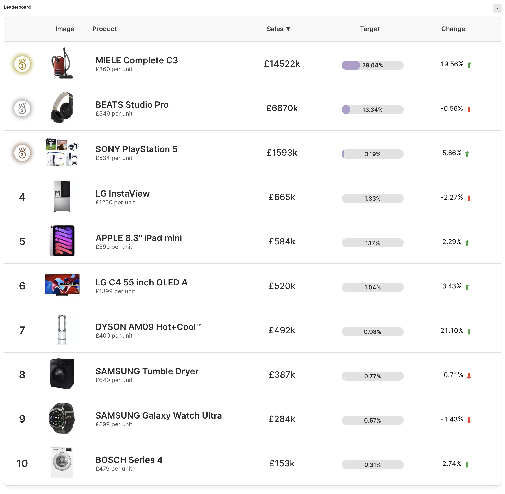
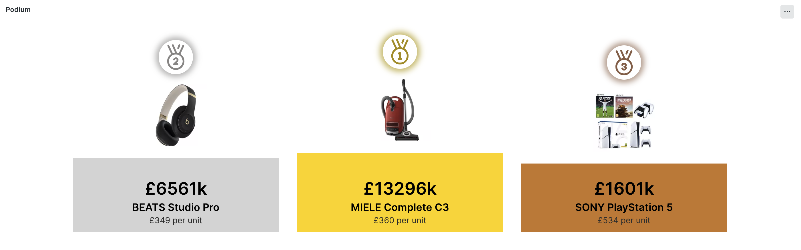
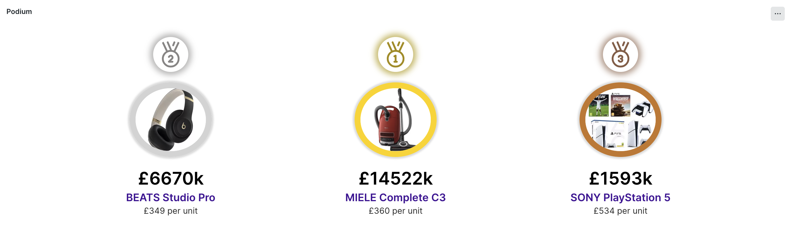

# Retail Leaderboard & Podium Visualizations

This pack includes two visualizations for displaying business data in leaderboard/podium style. They can be used for displaying any data type but are particularly suited for retail business data.

## [Leaderboard Visualization](visualizations/leaderboard/README.md)

Leaderboard Visualization is a dynamic and animated web app that allows you to visualize the ranking of the top X values from your dataset. It displays the position, values ranked, optional image, percentage of the total (configurable), and the change in the last x hours.

[Leaderboard visualization configuration instructions here](visualizations/leaderboard/README.md)

## [Podium Visualization](visualizations/podium/README.md)

The podium visualization allows you to highlight top values from your data set in a podium style view. Display is customizable.

[Podium visualization configuration instructions here](<(visualizations/podium/README.md)>)

> Data in screen shots is simulated!

## Installation

Clone the repository and run `npm install` to install dependencies.

You will need a development profile, you can read more about how to set up on the New Relic [developer site](https://developer.newrelic.com/)

To summarise the steps required:

- Navigate to the "Build your own Nerdpack" tile under `+Add data > Apps and visualizations`
- Follow steps one to three to download and install the NR1 CLI, generate API key and add the key to your profile (`nr1 profiles:add --name {account-slug} --api-key {api-key} --region {us|eu} `)
- Ensure the correct profile is selected: `nr1 profiles:default`
- Generate a new UUID for your app deployment: `nr1 nerdpack:uuid -gf`

### Testing

You can test locally by running `nr1 nerdpack:serve`

### Deploy to account

To use the custom visualisation you must deploy it to your account following these steps:

- Ensure the correct profile is selected: `nr1 profiles:default`
- Publish the assets: `nr1 nerdpack:publish`
- Deploy to production: `nr1 nerdpack:deploy`
- Subscribe your account: `nr1 subscription:set`

The custom visualizations should now appear as an option in the Custom Visualizations app (in the Apps > Custom Visualizations). Select the custom visualization, configure it and save to a dashboard.

Pro tip: Once a custom visualization is on a dashboard, you can click the ellipses to duplicate it.
