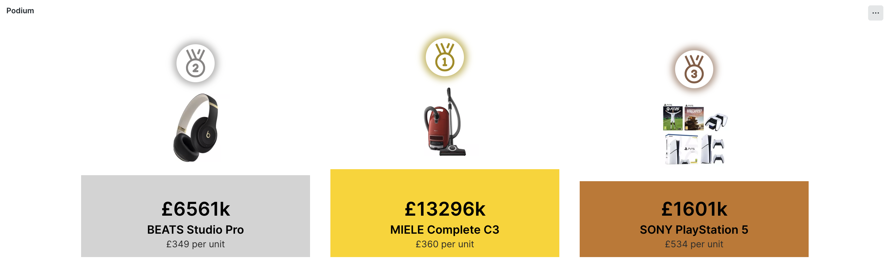
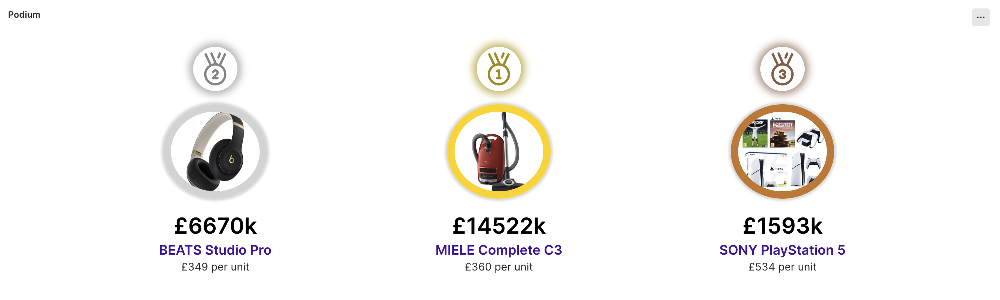

# Podium Visualization



The podium visualization allows you to highlight top values from your data set in a podium style view. Display is customizable.

## Configuration Options
The following configuration options are provided via the visualization configuration window. Most are optional.

- `Account Id` & `Query`: The data query to hydrate the visualization. See below for details. Required.
- `Podium Ordering`: If toggled on then the 1st place is shown in between second and third, like on a podium!
- `Podium Colors`: If toggled on the colours gold, silver and bronze will be used.
- `Hide Rosettes`: If toggled on will replace the rosettes with simple circles.
- `Circular display`: If toggeled on will show the items in a circle rather thna on podium blocks.
- `Decoration color`: Color for blocks/circles. Overrides podium colouring. CSS Hex color.
- `Caption color`: Text colour for the caption. CSS Hex color.
- `Sub Caption color`:  Text colour for the sub caption. CSS Hex color.
- `Value color`: Text colour for the value display. CSS Hex color.
- `Refresh interval`: Number of seconds between auto refresh. Default 1 minute.
- `Ignore time picker`: If toggled on changes to the dashboardtime picker will be ignored.
- `Default since/until calues`: Used to provide the default since/until for when default is selected in the time picker.

## Data Query

The query should provide data in the specified columns. The value column should be selected first as this infers the ordering:

- `value`: The value. Required (to infer ordering).
- `valueDisplay`: Value to display, may be text and allows for decoration. `Value` will be used if omitted. Optional.
- `caption`: The caption to display. Required.
- `subCaption`: The value to display beneath the caption. Optional.
- `link`: Link to navigate to if clicked. Optional.

### Example Query

This example query uses event type Transaction to demonstrate how you might query the required data. Note the `LIMIT 3` on the inner query limiting the output to three items.

```
SELECT 

latest(throughput) AS value,
latest(concat(string(throughput, precision:2),' rpm')) AS valueDisplay,

latest(appName) AS caption, 
latest(concat(string(duration, precision:5),' avg duration')) AS subCaption,

latest(concat('https://your-url-target/',appName)) AS link

FROM (
 FROM Transaction 
 SELECT 
 rate(count(*), 1 minute) AS throughput,
 average(duration) AS duration,
 latest(appId) AS appId
 FACET appName AS appName
 LIMIT 3
)

FACET appName
LIMIT max
SINCE 1 HOUR AGO
```
