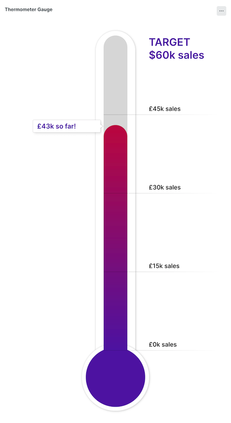

# Thermometer Gauge Visualization


The thermometer gauge visualization allows you to plot a single value against a target with a thermometer / totalizer style visualisation. 

## Configuration Options

The following configuration options are provided via the visualization configuration window. Most are optional.

- `Account Id` & `Query`: The data query to hydrate the visualization. See below for details. Required.
- `Color gradient`: A comma seperated list of CSS hex values defining the gradient stop colors used. From top to bottom.
- `Number of steps`: The number of progress indicator steps to include on the chart.
- `Format pattern for step label`/`for current value`/`for target value`: A replacement string pattern for the steps, current and target values. The special value `[[value]]` will be replaced with the actual numeric value. `\n` will be interpreted as a line break. e.g. `$[[[value]] sales`
- `Decimal places`: The number of decimal places to display values with.
- `Decoration color`: Allows you ste change color of the current value and target labels  with a CSS hex color.
- `Size style`: Allows you to adjust the size of the gauge.
- `Refresh interval`: Number of seconds until data is auto-refreshed.
- `Ignore time picker`: Ignores the dashboard time picker
- `Default since/until`: Provide since/until caluse here instead of in query to allow visualisation to work with the time picker in dashboards.

## Data Query

The query should provide a single row result with data in the specified columns. 

- `value`: The current value value.
- `target`: The target value.
- `startValue`: Optional start value, if omitted chart starts at zero.

> Avoid including a SINCE/UNTIL in your query, instead supply this via the configuration option to ensure better compatibility with the dashboard time picker. 


### Example Query

Here are some example queries, they are very straight forward:

A toy example that value will change every second 0-60:
```
FROM Transaction 
select latest(toDatetime(timestamp, 'ss')) as value, 
60 as target, 
0 as startValue
```

An example using transaction data:
```
FROM Transaction 
select count(*) as value, 
1000000 as target, 
0 as startValue
```
